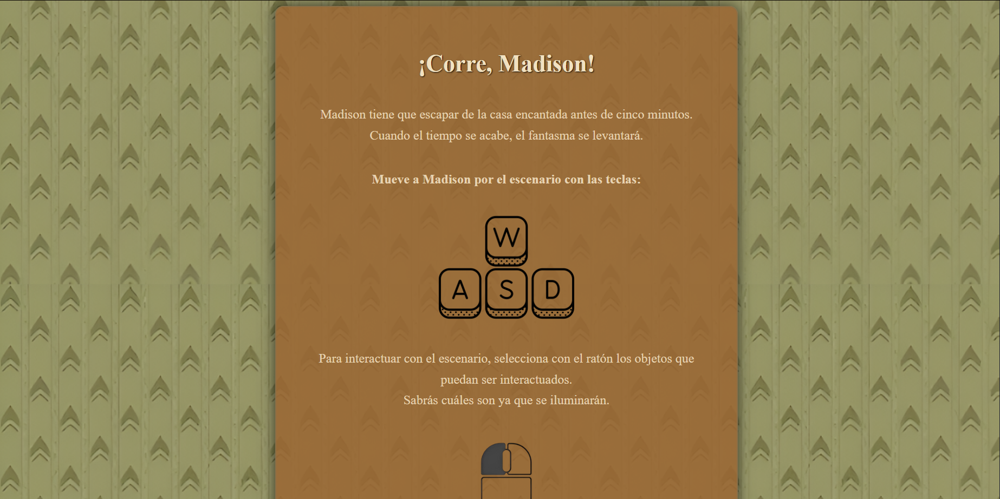
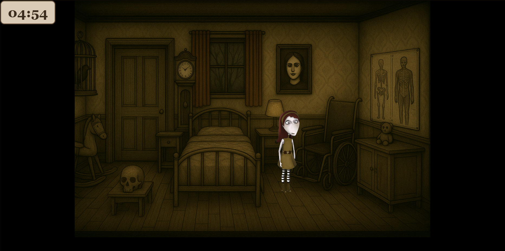
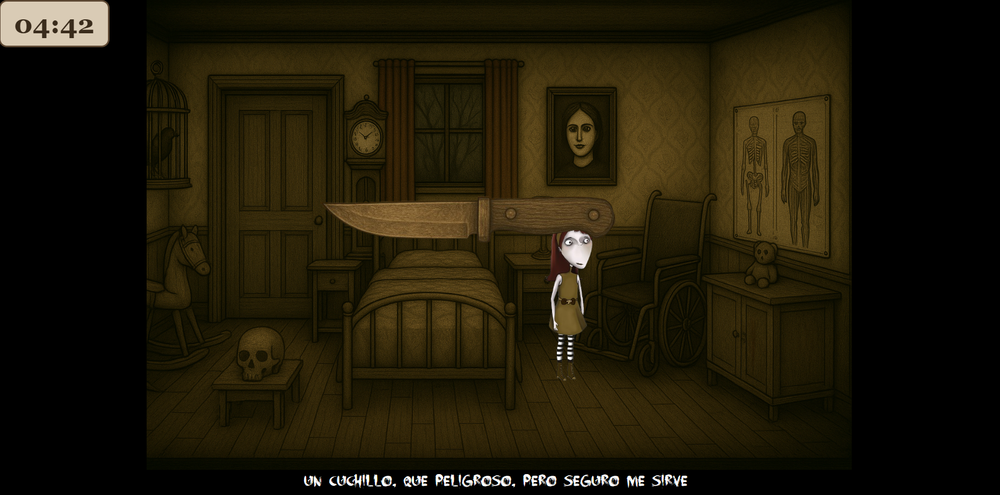
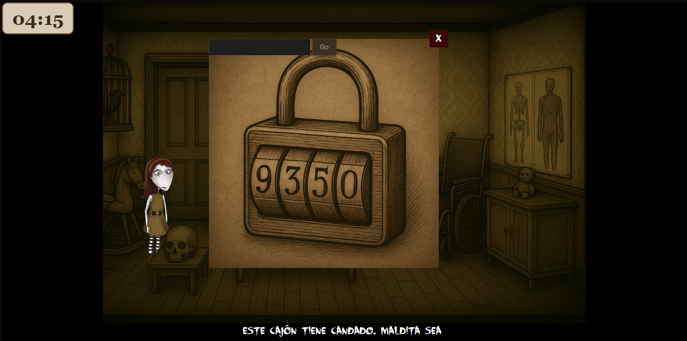
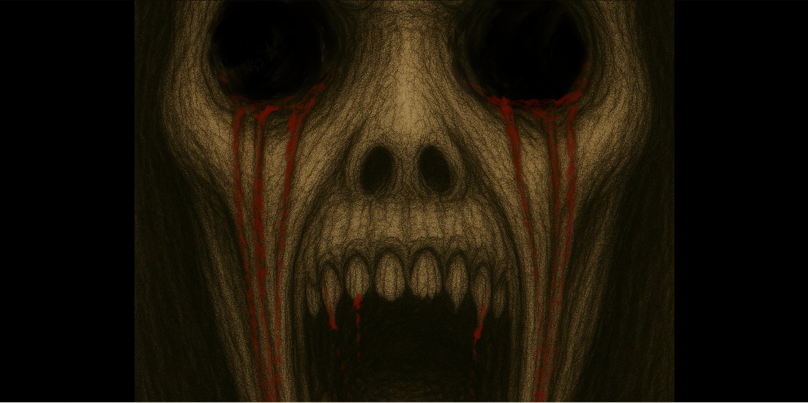
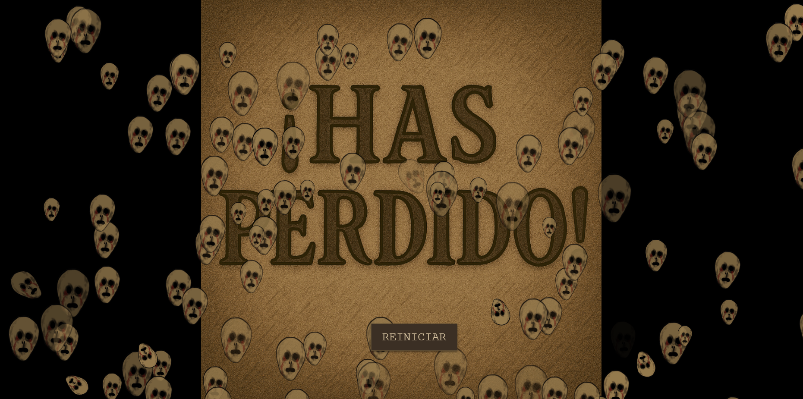

# Práctica 4.1
Proyecto de Creación Multimedia Interactiva de la Facultad de Bellas Artes de la Univesidad de Granada

## 1 Datos
Titulo : Práctica 4.1 sobre el videojuego de Madison (practica 3.1)

Web: (url github.io)

Autor: Tania Corral Dueñas 

Resumen : En este proyecto esta incluido el videojuego de Madison. Este este videojuego controlas a una niña que tiene el objetivo de escapar de una casa enbrujada antes de cinco minutos. Deberás interactuar con los objetos de la casa para poder salir.

Estilo/género:  juego 

Resolución: 1490x700 no reescalable

Probado en: Opera, Google chrome, Firefox

Tamaño proyecto: 25MB

Fecha : 23/05/2025

Medios (donde se tiene presencia relacionada):

Github:

## 2. Memoria del proyecto
### 2.1. Storyboard:
Madison aparece en la casa y busca alguna manera de poder escapar.

En un cajón encuentra un cuchillo y se lo guarda.

En la pared hay un cuadro, si Madison tiene el cuchillo, lo rajará y verá una combinación de cuatro números.

Encontrará otro cajón con un candado numérico, al introducir el numero del cuadro en el candado se abrirá.

Dentro habrá una llave que Madison cogerá y usará para abrir la puerta y conseguir escapar.

## 3. Metodología

Etapa 1: Metodología de desarrollo de productos multimedia basado en una metodología de UX (User Experience)

Este proyecto es interesante porque es un juego que mezcla elementos de horror en un diseño un tanto infantilizado. 

Orientado a cualquier público mayor de 10 años. 

Etapa 2: Desarrollo / actividades realizadas

Para mover a Madison a través del escenario se utilizan las teclas w a s d. Para interactuar con los objetos se usa el cursor y el click izquierdo.

Etapa 3: Problemas identificados
No fucnionó bien la posición de los objetos debido a un fallo en la resolución del fondo. Esta ya arreglado haciendo el fondo estático.

## 4. Conclusiones
Ha sido una experiencia interesante aunque bastante complicada ya que nunca habia tenido un acercamiento de este calibre en el ámbito de la programación. Aun así, ha sido interesante ver nuevas formas de creación de arte, inclinado más a la rama más "tecnológica". 

## 5 Referencias
**Artículos y blogs **

Recursos y materiales audiovisuales:
Chatgpt
Mozilla
Stack Overflow
El Tutorial de Java Script Moderno
W3 Schools

Mayo 2025
